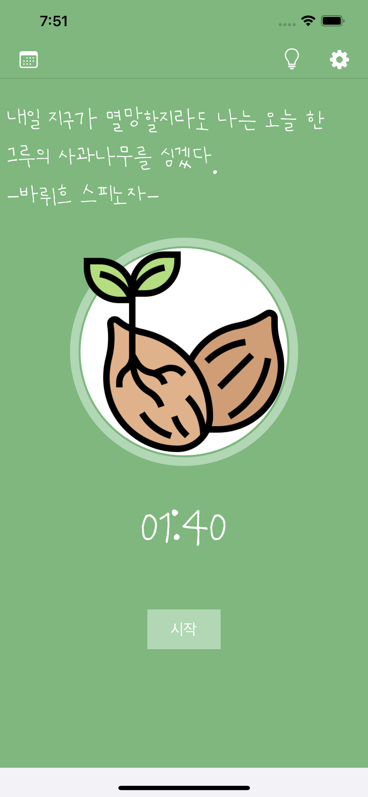

# Apple Tree - 집중 타이머

Apple Tree - 나를 발전시키는 소중한 시간

Apple Tree는 스마트폰 중독을 방지하기 위한 앱입니다. 핸드폰의 유혹 속에 빠져 나오지 못하는 이들에게, 핸드폰을 내려놓고 자신의 개발에 온전히 집중할 수 있도록 합니다. 자신을 가꾸며 함께하는 당신의 사과나무를 키워보세요. 사과나무를 많이 가꿀수록, 당신의 미래도 함께 성장해 갈 것입니다.

## 개발 정리 표

| 날짜         | 기능                                                         | etc.                                                      |
| ------------ | ------------------------------------------------------------ | --------------------------------------------------------- |
| 22.09.12(월) | Circular Progress View / Timer / Calendar 구성               | Circular Progress 적용                                    |
| 22.09.13(화) | Realm 구축 및 Calendar 아이콘 적용 / Repository 패턴 적용 / UIColor 재설정 | Color 참고 사이트 : https://colorhunt.co/palettes/popular |
| 22.09.14(수) | Realm 설계 및 Singleton 패턴 사용                            | realm에서 filter 부분 error 발생                          |

## 개발 일기

### 22.09.12 (월)

- 첫 화면의 UI 구성 및 시간이 줄어들 때 CircularProgress Bar 게이지가 함께 증가하도록 구현
- 팝업화면을 구성하고, 지정된 시간이 다 지나면, 팝업 화면이 새로 뜨도록 설정
- Font를 적용
- 네비바 calendar 버튼을 클릭 시 나타나는 화면에 calendar가 뜨도록 구성(FSCalendar 사용)

#### - 첫 화면의 UI 구성 및 시간이 줄어들 때 CircularProgress Bar 게이지가 함께 증가하도록 구현

Circular Progress Bar 구현

~~~swift
class CircularProgress: UIView {

    fileprivate var progressLayer = CAShapeLayer()
    fileprivate var tracklayer = CAShapeLayer()
    
    /*
    // Only override draw() if you perform custom drawing.
    // An empty implementation adversely affects performance during animation.
    override func draw(_ rect: CGRect) {
        // Drawing code
    }
    */
    
    override init(frame: CGRect) {
        super.init(frame: frame)
        createCircularPath()
    }
    
    required init?(coder aDecoder: NSCoder) {
        super.init(coder: aDecoder)
        createCircularPath()
    }
    
    var progressColor:UIColor = UIColor.red {
        didSet {
            progressLayer.strokeColor = progressColor.cgColor
        }
    }
    
    var trackColor:UIColor = UIColor.white {
        didSet {
            tracklayer.strokeColor = trackColor.cgColor
        }
    }
    
    fileprivate func createCircularPath() {
        self.backgroundColor = UIColor.clear
        self.layer.cornerRadius = self.frame.size.width/2.0
        let circlePath = UIBezierPath(arcCenter: CGPoint(x: frame.size.width / 2.0, y: frame.size.height / 2.0),
        radius: (frame.size.width - 1.5)/2, startAngle: CGFloat(-0.5 * Double.pi),
        endAngle: CGFloat(1.5 * Double.pi), clockwise: true)
        
        tracklayer.path = circlePath.cgPath
        tracklayer.fillColor = UIColor.clear.cgColor
        tracklayer.strokeColor = trackColor.cgColor
        tracklayer.lineWidth = 10.0;
        tracklayer.strokeEnd = 1.0
        layer.addSublayer(tracklayer)
        
        progressLayer.path = circlePath.cgPath
        progressLayer.fillColor = UIColor.clear.cgColor
        progressLayer.strokeColor = progressColor.cgColor
        progressLayer.lineWidth = 10.0;
        progressLayer.strokeEnd = 0.0
        layer.addSublayer(progressLayer)
        
    }
    
    func setProgressWithAnimation(duration: TimeInterval, value: Float) {
        let animation = CABasicAnimation(keyPath: "strokeEnd")
        animation.duration = duration
        // Animate from 0 (no circle) to 1 (full circle)
        animation.fromValue = 0
        animation.toValue = value
        animation.timingFunction = CAMediaTimingFunction(name: CAMediaTimingFunctionName.linear)
        progressLayer.strokeEnd = CGFloat(value)
        progressLayer.add(animation, forKey: "animateCircle")
    }

}
~~~

#### - 팝업화면을 구성하고, 지정된 시간이 다 지나면, 팝업 화면이 새로 뜨도록 설정

새로운 메서드들을 많이 적용해서 코드가 clean하지 못함 -> 후에 Refactoring 해줄 것. 

~~~swift
@objc func startButtonClickedCountDown() {

        if startButtonBool == true {
            startButtonBool.toggle()
            self.mainview.startButton.setTitle("중지", for: .normal)
            timer = Timer.scheduledTimer(withTimeInterval: 0.01, repeats: true) { (t) in
                self.mainview.settingCount -= 1
                let minutes = self.mainview.settingCount / 60
                let seconds = self.mainview.settingCount % 60
                
                if self.mainview.settingCount > 0 {
                    self.mainview.countTimeLabel.text = String(format: "%02d:%02d", minutes, seconds)
                    self.mainview.countTimeLabel.text = "\(minutes):\(seconds)"
                    self.progress = Float(self.mainview.settingCount) / 1800.0
                    print(self.progress)
                    self.mainview.circularProgressBar.setProgressWithAnimation(duration: 0.0001, value: 1.0 - self.progress)

                } else {
                    self.mainview.countTimeLabel.text = "00:00"
                    self.mainview.startButton.setTitle("완료", for: .normal)
                    self.timer?.invalidate()
                    self.timer = nil
                    self.finishPopupVCAppear()
                    self.mainview.settingCount = 1800
                    self.mainview.countTimeLabel.text = "30:00"          
                }
            }
        } else {
            startButtonBool.toggle()
            self.mainview.startButton.setTitle("시작", for: .normal)
            timer?.invalidate()
            timer = nil
        }
        
    }
~~~

#### - Font를 적용

#### - 네비바 calendar 버튼을 클릭 시 나타나는 화면에 calendar가 뜨도록 구성(FSCalendar 사용)

### 22.09.13 (화)

- UI 색상을 전체적으로 변경 Colorhunt 참고
- calendar 안에 icon이 들어갈 수 있게 icon 이미지를 구성
- Realm 구조 설계 및 Repository Pattern으로 구성
- Typora를 사용하여 README를 구성

color hunt를 사용하여 구성한 색상 조합

#### - UI 색상을 전체적으로 변경 - Colorhunt 참고

색 조합을 이용하여 구성한 화면

#### - calendar 안에 icon이 들어갈 수 있게 icon 이미지를 구성

icon을 사용하여 calendar에 넣어주기

~~~swift
func calendar(_ calendar: FSCalendar, imageFor date: Date) -> UIImage? {
        let seedsImg = resizeImage(image: UIImage(named: "seeds")!, width: 20, height: 20)
        let sproutImg = resizeImage(image: UIImage(named: "sprout")!, width: 20, height: 20)
        let appleImg = resizeImage(image: UIImage(named: "apple")!, width: 20, height: 20)
        let appleTreeImg = resizeImage(image: UIImage(named: "apple-tree")!, width: 20, height: 20)
        switch dateFormatter.string(from: date) {
        case dateFormatter.string(from: Date()):
            return appleImg
        case "2022-09-06":
            return appleTreeImg
        case "2022-09-07":
            return sproutImg
        case "2022-09-08":
            return seedsImg
        default:
            return nil
        }
    }
~~~

#### - Realm 구조 설계 및 Repository Pattern으로 구성

Realm Schema

~~~swift
class AppleTree: Object {
    @Persisted var ATDate: String
    @Persisted var ATTime: Int

    @Persisted(primaryKey: true) var objectId: ObjectId
    
    convenience init(ATDate: String, ATTime: Int) {
        self.init()
        self.ATTime = 0
        self.ATDate = ATDate
    }
}
~~~

Repository Pattern

~~~SAS
protocol ATRepositoryType {
    func fetch() -> Results<AppleTree>
    func addItem(item: AppleTree)
    func updateItem(item: AppleTree, appendTime: Int)
}

class ATRepository: ATRepositoryType {
        
    let localRealm = try! Realm()
    
    func fetch() -> Results<AppleTree> {
        return localRealm.objects(AppleTree.self).sorted(byKeyPath: "ATDate", ascending: true)
    }

    
    func addItem(item: AppleTree) {
        try! localRealm.write {
            localRealm.add(item)
        }
    }
    
    func updateItem(item: AppleTree, appendTime: Int) {
        
//        var totalTime = item.ATTime
        var totalTime = item.ATTime
        totalTime += appendTime
        
        try! localRealm.write {
     
            item.ATTime = totalTime
        }
        print("저장되었습니다.", item.ATTime)
    }
}

~~~

### 22.09.14 (수)

- Realm 구조 재설계
- Singleton Pattern을 활용한 DateFormatter 지정
- Realm에 날짜 데이터 및 시간 데이터 저장 구현
- Realm에서 Filter 사용 중 적용 에러 발생 -> 해결

#### - Realm 구조 재설계

ATDate를 Date 타입으로 받으면 같은 날에 데이터 값을 함께 처리하지 못하게 되는 문제 인지 -> String 타입으로 변환

~~~swift
class AppleTree: Object {
    @Persisted var ATDate: String
    @Persisted var ATTime: Int

    @Persisted(primaryKey: true) var objectId: ObjectId
    
    convenience init(ATDate: String, ATTime: Int) {
        self.init()
        self.ATTime = ATTime
        self.ATDate = ATDate
    }
}
~~~

#### - Singleton Pattern 활용해 DateFormatter 지정

Realm에 날짜를 넣을 때 똑같은 양식으로 String값을 지정해주어야 하기 때문에 singleton 패턴으로 DateFormatter을 지정

~~~swift
class DateFormatterHelper {
    
    private init() {}
    
    static let Formatter = DateFormatterHelper()
    let dateFormatter = DateFormatter()
    let date = Date()
    
    func formatDate() {
        
        dateFormatter.dateFormat = "yyyy-MM-dd"
    }
    
    var dateStr: String {
        get {
            formatDate()
            return dateFormatter.string(from: date)
        }
    }
}

~~~

#### - Realm에 날짜 데이터 및 시간 데이터 저장 구현

작성하니 간결하지만, 많은 오류들이 있었다. 특히 값에 접근하지 못해 Realm의 ATTime이 add는 되는데 update가 되지 않는 상황이 발생.

해결 방법 : result가 이미 filter된 값이기 때문에 result의 [0]에 접근하여 값을 업데이트 해주었음.

~~~swift
@objc func okButtonClicked() {

        let result = repository.localRealm.objects(AppleTree.self).filter("ATDate == '\(DateFormatterHelper.Formatter.dateStr)'" )
      
        if result.isEmpty {
            repository.addItem(item: AppleTree(ATDate: DateFormatterHelper.Formatter.dateStr, ATTime: MainView().settingCount))
        } else {
            self.repository.updateItem(item: result[0], appendTime: MainView().settingCount)

            repository.fetch()

        }
        dismiss(animated: true)
    }
~~~

#### - Realm에서 Filter 사용 중 적용 에러

해결방법 : realm에서 문자열에 접근할 때 filter 영역에서 문자열 보간법으로 접근하면 되는 줄 알았는데, 작은 따옴표를 안에 넣어주어야 한다는 것을 깨달았다.

~~~swift
repository.localRealm.objects(AppleTree.self).filter("ATDate == '\(DateFormatterHelper.Formatter.dateStr)'" )
~~~

